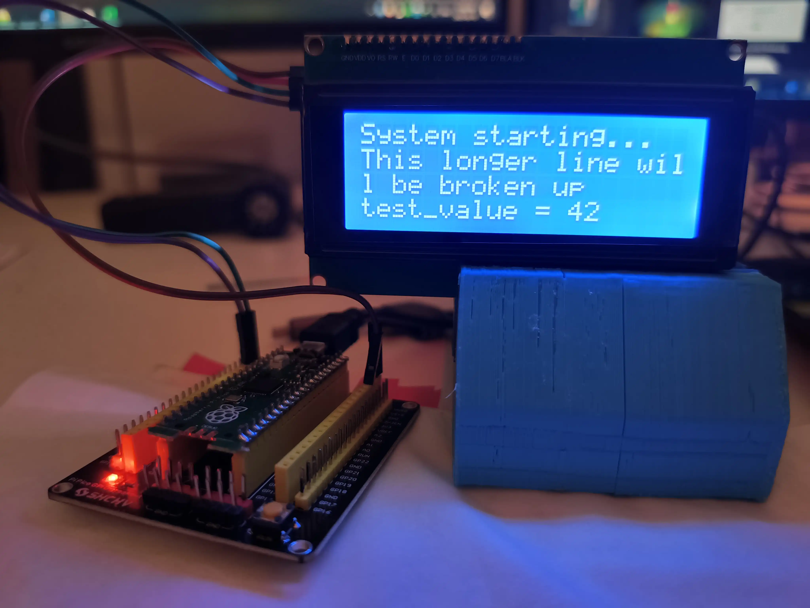

# LCD2004 — MicroPython Driver and Basic Logging Console

LCD2004 is a MicroPython driver for HD44780-compatible 20×4 character LCDs using a PCF8574 I2C backpack, plus a simple scrolling log console wrapper.

It lets you use an LCD2004 as a quick logging console:

```python
from lcd2004.simple_console import SimpleConsole

my_lcd_log = SimpleConsole(sda=0, scl=1)

my_lcd_log.log("System starting...")
my_lcd_log.log("This longer line will be broken up")
test_value = 42
my_lcd_log.log(f"test_value = {test_value}")
```



---

## Features

- Works with common 20×4 LCD modules over I2C using PCF8574 backpacks

- **Simple console wrapper (SimpleConsole)**
  - Line-by-line output
  - Configurable orientation (top-down or bottom-up through the `recent_first` flag) with automatic scroll
  - Optional text wrapping

- **Bare driver (LCD2004)**
  - Clear display / home
  - Set cursor position
  - Backlight on/off
  - Display on/off, cursor, blink
  - Hardware display shift (left/right)
  - Custom character (CGRAM) support

---

## Quick Start

With the `lcd2004/` folder copied to your device’s root or `/lib` directory:

#### Using SimpleConsole (basic log, text-only)

```python
from lcd2004.simple_console import SimpleConsole

my_log = SimpleConsole(sda=0, scl=1)

my_log.log("Some text")
my_log.log("This longer line will be broken up")
your_variable = 42
my_log.log(f"Value = {your_variable}")
```

#### Using the driver directly

```python
from lcd2004.driver import LCD2004

# Minimal init (creates I2C internally)
lcd = LCD2004(sda=0, scl=1, freq=400_000, auto_flush=False)

lcd.clear() # Clear content and reset cursor to (0, 0)
lcd.set_backlight(True) # Set backlight on or off

# Writing four lines of text
lcd.set_cursor(0, 0) # Move to column 0, row 0
lcd.write("Hello, world!")
lcd.set_cursor(0, 1) # Move to column 0, row 1
lcd.write("Line 2")
lcd.set_cursor(0, 2) # Move to column 0, row 2
lcd.write("Line 3")
lcd.set_cursor(0, 3) # Move to column 0, row 3
lcd.write("Line 4")

lcd.set_display(True) # Show or hide the display's content
lcd.set_cursor_visible(True) # Show or hide the cursor glyph
lcd.set_blink(True) # Show or hide a blinking block at cursor position

# Creating a custom 5×8 bitmap character (degree symbol) in CGRAM slot 0
DEG_SYMBOL = [
    0b00110,  # ··██·
    0b01001,  # ·█··█
    0b00110,  # ··██·
    0b00000,  # ·····
    0b00000,  # ·····
    0b00000,  # ·····
    0b00000,  # ·····
    0b00000   # ·····
]
lcd.create_char(0, DEG_SYMBOL)  # Store in CGRAM slot 0

# Write "23.4°C" at column 12, row 1 using the custom char
lcd.set_cursor(12, 1)
lcd.write("23.4")
lcd.write(chr(0))  # custom char 0 (degree symbol)
lcd.write("C")

# Flush manually, since we have auto_flush=False
lcd.flush()
```

---

## Installation

Copy the `lcd2004/` folder into your MicroPython root or `/lib` directory:

```text
/lib/lcd2004/driver.py
/lib/lcd2004/simple_console.py
```

Import as:

```python
from lcd2004.simple_console import SimpleConsole
# or
from lcd2004.driver import LCD2004
```

## Acknowledgements

Development of this project was informed by the following open-source libraries and technical references:

#### Open-Source Libraries

- **[Micropython_LCD1602_LCD2004_I2C_Lib](https://github.com/liyuanhe211/Micropython_LCD1602_LCD2004_I2C_Lib)**  
  *License:* CC BY-NC-SA 4.0  
  *Author:* liyuanhe211  
  MicroPython driver for HD44780-based LCDs over I2C.

- **[raspberry_lcd4x20_I2C](https://github.com/ArcadiaLabs/raspberry_lcd4x20_I2C)**  
  *License:* GPL-2.0  
  *Author:* ArcadiaLabs  
  Raspberry Pi Python library for 20x4 LCDs with I2C backpack.

#### Technical References

- **[Hitachi HD44780U LCD Controller Datasheet](https://cdn.sparkfun.com/assets/9/5/f/7/b/HD44780.pdf)**  
  Official datasheet for the HD44780 LCD controller.

- **[Microchip Application Note AN587](https://ww1.microchip.com/downloads/en/AppNotes/00587b.pdf)**  
  Practical guide to HD44780-compatible LCD interfacing.

- **[TI PCF8574 I2C I/O Expander Datasheet](https://www.ti.com/lit/ds/symlink/pcf8574.pdf)**  
  Official datasheet for the PCF8574 I2C I/O expander.


---

## License

MIT — see [LICENSE](LICENSE).

---

## Author

Jean-Marie Prévost
[https://github.com/JeanMariePrevost](https://github.com/JeanMariePrevost)
